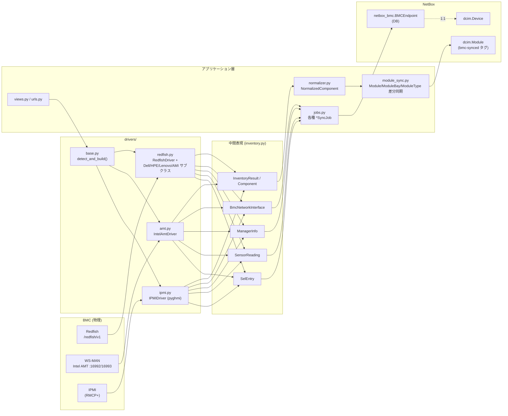
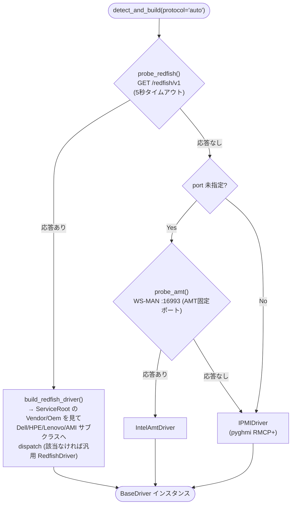
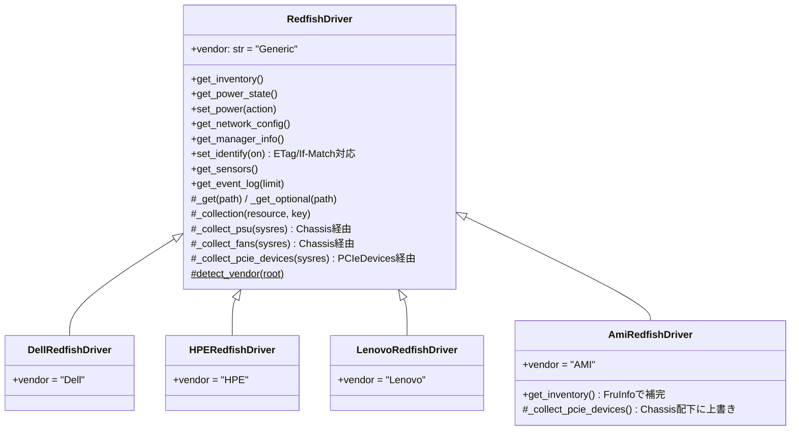
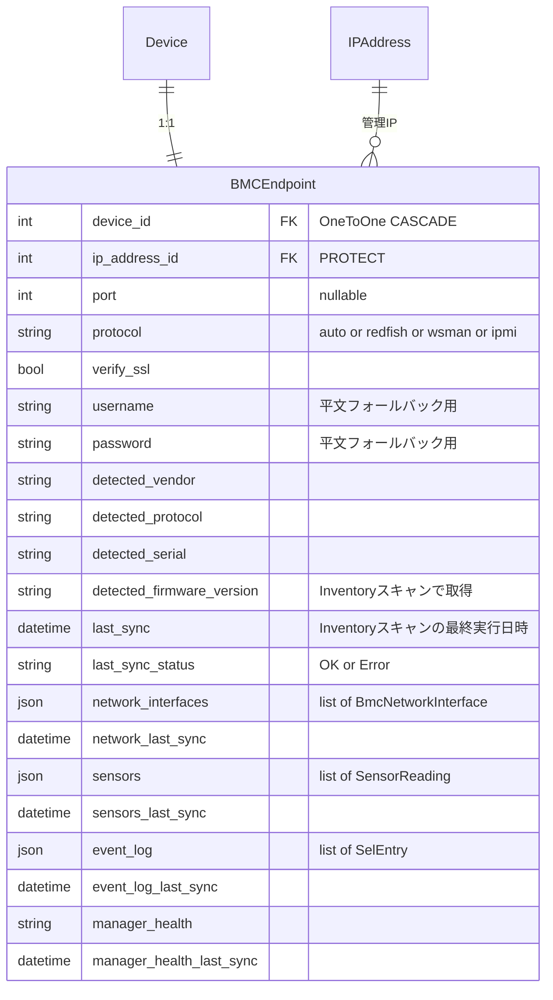
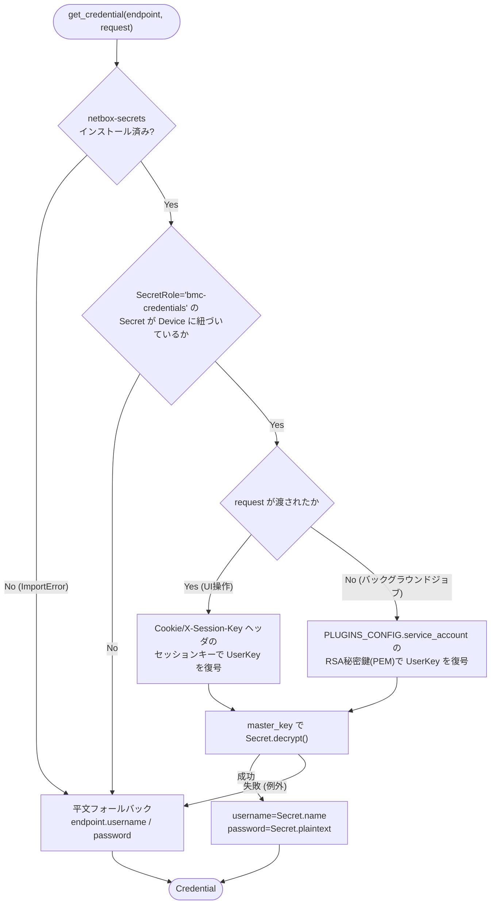
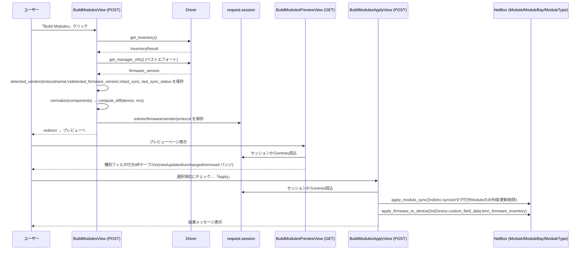
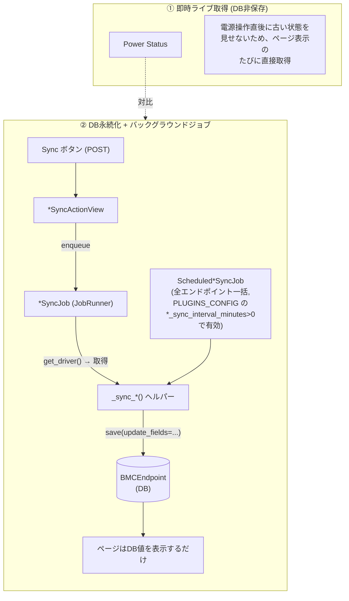
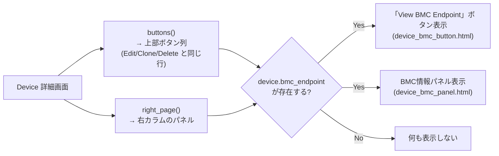
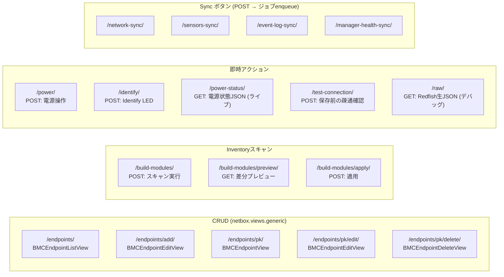

# netbox-bmc 詳細設計書

本書は `netbox_bmc` プラグインの内部設計を、コードから読み取れる実装事実に基づいて記述する
詳細設計書である。要約された方針は `CLAUDE.md` を参照。ここでは各レイヤの責務・データフロー・
主要シーケンスを図とともに掘り下げる。

## 目次

1. [全体アーキテクチャ](#1-全体アーキテクチャ)
2. [プロトコル自動検出](#2-プロトコル自動検出)
3. [ドライバ層](#3-ドライバ層)
4. [データモデル (BMCEndpoint)](#4-データモデル-bmcendpoint)
5. [認証情報解決](#5-認証情報解決)
6. [Module インベントリ同期](#6-module-インベントリ同期)
7. [バックグラウンド同期の2系統](#7-バックグラウンド同期の2系統)
8. [Device 画面への統合](#8-device-画面への統合)
9. [URL / View 一覧](#9-url--view-一覧)
10. [REST API](#10-rest-api)
11. [i18n](#11-i18n)
12. [既知の制限](#12-既知の制限)

---

## 1. 全体アーキテクチャ

レイヤ分離が設計の中心にある。ドライバ層は NetBox / Django を一切知らず、
中間表現(`inventory.py`)だけを返す。NetBox への書き込みは Normalizer / Sync / Job 層が担う。

**重要な不変条件**

- ドライバ層 (`drivers/`) は NetBox を import しない。戻り値は `inventory.py` のデータクラスのみ。
- Module 同期の差分管理は `bmc-synced` タグで分離する。手動作成 Module には触れない。
- Redfish のパスはハードコードせず `ServiceRoot` からのリンク探索で得る(ベンダー間のパス差分を
  コード変更なしに吸収するための設計)。

---

## 2. プロトコル自動検出

`BMCEndpoint.protocol` が `auto` の場合、`drivers/base.py:detect_and_build()` が以下の順で
プロービングする。

`protocol` が `redfish` / `ipmi` / `wsman` に明示指定されている場合はプロービングをスキップし、
該当ドライバを直接構築する。

---

## 3. ドライバ層

### 3.1 BaseDriver インターフェース (`drivers/base.py`)

全ドライバ共通の抽象メソッド。未対応の機能は `NotImplementedError` を送出する
(呼び出し側の View / Job はこれを捕捉して「このプロトコルでは未対応」として扱う)。

| メソッド | 用途 | 対応状況 |
|---|---|---|
| `get_inventory()` | CPU/Memory/Drive/PSU/Fan/PCI/Firmware 一式取得 | Redfish, IPMI, AMT(一部) |
| `get_power_state()` / `set_power(action)` | 電源状態取得・操作 | Redfish, IPMI |
| `get_network_config()` | BMC 自身の NIC 設定一覧(複数可) | Redfish, IPMI |
| `get_manager_info()` | BMC ファームウェア/ヘルス | Redfish, IPMI |
| `set_identify(on)` | Identify LED 点灯/消灯 | Redfish, IPMI |
| `get_sensors()` | 温度/Fan/電圧/消費電力の実測値 | Redfish, IPMI |
| `get_event_log(limit)` | System Event Log 直近 N 件 | Redfish, IPMI |

### 3.2 Redfish ドライバ (`drivers/redfish.py`)

- パス探索は `ServiceRoot`(`/redfish/v1`) → `Systems`/`Managers`/`Chassis` の各コレクションを
  辿る方式で、ベンダー固有 URI を直書きしない。
- PSU/Fan/センサー(温度・電圧・消費電力)は `Systems[0].Links.Chassis` を辿った先の
  `Thermal` / `Power` リソースから取得する。
- ネットワーク設定は **`Managers/{id}/EthernetInterfaces`** から取得する
  (`Systems/{id}/EthernetInterfaces` はホスト OS 側の NIC であり別物なので注意)。
  USB ガジェット系インターフェース(`usb0` 等)は一覧から除外する。IPv4/IPv6 両方に対応。
  複数インターフェース(専用ポート/ホスト共有ポート/ボンディング等)を list で返す。
- Identify LED は `Chassis.LocationIndicatorActive` を PATCH する。ETag(`@odata.etag` または
  HTTP `ETag` ヘッダ)を `If-Match` として送信し、`HTTP 428 Precondition Required` を返す
  厳格な実装(Dell iDRAC 系)にも対応する。PATCH が拒否された場合は旧スキーマの
  `IndicatorLED` 文字列 enum にフォールバックする。
- ベンダー検出は `ServiceRoot` の `Vendor` / `Oem` キーを見て `VENDOR_DRIVERS` マップから
  サブクラスへ差し替える(`build_redfish_driver()`)。該当ベンダーがなければ汎用
  `RedfishDriver` のまま続行する(例外にしない)。

### 3.3 IPMI ドライバ (`drivers/ipmi.py`)

`pyghmi` (RMCP+) ベース。ファームウェアバージョンは標準 "Get Device ID" raw コマンド
(`netfn=0x06, command=0x01`)で取得し、ベンダー拡張には依存しない。ヘルスは
`pyghmi` の `get_health()`(内部で `get_sensor_data()` を集約)を利用する。
ネットワーク設定は `get_net_configuration()` / `get_net6_configuration()` を使い、
IPv6 はベストエフォート(取得失敗時は空のまま継続)。

### 3.4 Intel AMT ドライバ (`drivers/amt.py`)

WS-MAN (SOAP/XML over HTTP) を直接叩く実装で、追加ライブラリなし(`requests` + 標準の
`xml.etree.ElementTree`)。HTTP Digest 認証、ポート 16992(HTTP)/16993(HTTPS) 固定。
CPU/Memory/AMT ファームウェアバージョンの取得に対応(AMT 6.0 以降 = vPro 第1世代以降)。

---

## 4. データモデル (BMCEndpoint)

`BMCEndpoint` は `Device` と 1:1 の `OneToOneField`。フィールドは用途ごとに明確なグループに
分かれている。

フィールドグループの意味:

| グループ | フィールド | 更新経路 |
|---|---|---|
| 接続設定 | `device`, `ip_address`, `port`, `protocol`, `verify_ssl` | ユーザーが Add/Edit フォームで設定 |
| 認証情報 (フォールバック) | `username`, `password` | netbox-secrets 未使用時のみ参照 (§5) |
| Inventory スキャン結果 | `detected_vendor`, `detected_protocol`, `detected_serial`, `detected_firmware_version`, `last_sync`, `last_sync_status` | `BuildModulesView`(「Build Modules」ボタン) |
| Network | `network_interfaces`, `network_last_sync` | `NetworkSyncJob` / `ScheduledNetworkSyncJob` |
| Sensors | `sensors`, `sensors_last_sync` | `SensorsSyncJob` / `ScheduledSensorsSyncJob` |
| Event Log | `event_log`, `event_log_last_sync` | `EventLogSyncJob` / `ScheduledEventLogSyncJob` |
| Manager Health | `manager_health`, `manager_health_last_sync` | `ManagerHealthSyncJob` / `ScheduledManagerHealthSyncJob` |

`detected_firmware_version` だけ「Inventory スキャン結果」グループに属する点に注意
(§7 で理由を説明)。Power Status は DB に保存されない(常にライブ取得)。

---

## 5. 認証情報解決

`BMCEndpoint.get_driver(request=None)` がドライバ生成の唯一の入口。認証情報の解決は
`credentials.py:get_credential()` が担う。netbox-secrets のセットアップ手順・実際の
動作検証手順は [NETBOX_SECRETS.md](NETBOX_SECRETS.md) を参照。

**Secret のレイアウト規約**

- `SecretRole.slug == "bmc-credentials"`
- `Secret.name` = BMC ユーザー名(非暗号化フィールド)
- `Secret.plaintext` = BMC パスワード(RSA 暗号化)
- `assigned_object` = 当該 `BMCEndpoint.device`

バックグラウンドジョブ(`request=None`)経路でセッションキーを使わない理由: ジョブの
`kwargs` を介してセッションキーを渡すと Job レコードに平文で残ってしまうため。
そのためサービスアカウントの RSA 秘密鍵を使う経路のみを実装している。

---

## 6. Module インベントリ同期

「Build Modules」ボタン(`BuildModulesView`)を起点に、スキャン → プレビュー → 適用の
3ステップで進む(即時同期。バックグラウンドジョブ化はしていない)。

`compute_diff()` は既存の `bmc-synced` タグ付き `Module` と検出コンポーネントを
`normalized_name` で突き合わせ、`new` / `updated` / `unchanged` / `removed` の4状態に分類する。
`ModuleBay` が存在しない場合は `new` エントリとして扱われ、適用時に自動作成される。

---

## 7. バックグラウンド同期の2系統

BMC から取得するデータは「変化頻度」によって扱いが分かれる、という設計判断がある。

対象と対応するジョブ:

| データ | Job (手動/ボタン) | Scheduled Job (全台一括) | 保存先フィールド |
|---|---|---|---|
| Network | `NetworkSyncJob` | `ScheduledNetworkSyncJob` | `network_interfaces` / `network_last_sync` |
| Sensors | `SensorsSyncJob` | `ScheduledSensorsSyncJob` | `sensors` / `sensors_last_sync` |
| Event Log | `EventLogSyncJob` | `ScheduledEventLogSyncJob` | `event_log` / `event_log_last_sync` |
| Manager Health | `ManagerHealthSyncJob` | `ScheduledManagerHealthSyncJob` | `manager_health` / `manager_health_last_sync` |
| BMC Firmware | (専用ジョブなし) | (専用ジョブなし) | `detected_firmware_version` ※Inventoryスキャンで更新 |

**なぜ BMC Firmware だけ専用ジョブを持たないか**: ファームウェアバージョンは滅多に変わらない
ため、専用の定期ジョブを持つコストに見合わない。そのため「Build Modules」実行時の
Inventory スキャンに相乗りさせて `detected_firmware_version` を更新する。一方 BMC Health は
ハードウェア状態次第で変化しうるため、独立した `ManagerHealthSyncJob` を持つ。

**Sync Status カードの紛らわしさ対策**: 上記いずれとも別に、Sync Status カードには
「Inventory Last Sync」「Inventory Scan Status」という行がある。これは `last_sync` /
`last_sync_status` フィールド、すなわち Module インベントリスキャンの実行結果であり、
Network/Sensors/Event Log/Health の同期時刻とは無関係。UI 上で紛らわしいため、意図的に
「Inventory」を冠したラベルにして区別している。

**Scheduled Job の冪等性**: `NetBoxBMCConfig.ready()` は Web/Worker プロセス起動のたびに
呼ばれるため、`_enqueue_scheduled_job()` は同名の Job が `pending`/`scheduled`/`running` で
既に存在する場合は登録をスキップする。マイグレーション未適用(Job テーブル未作成)の場合は
`DatabaseError` を握りつぶして何もしない。

---

## 8. Device 画面への統合

`template_content.py:DeviceBMCPanel` (`PluginTemplateExtension`, `models=["dcim.device"]`) が
Device 詳細画面に2箇所フックする。

`BMCEndpoint` が存在しない Device には何も注入しない(`_get_bmc_endpoint()` が
`device.bmc_endpoint` の `RelatedObjectDoesNotExist` を捕捉して `None` を返す)。

---

## 9. URL / View 一覧

---

## 10. REST API

`api/` 配下に `BMCEndpoint` の CRUD のみを提供する `NetBoxModelViewSet` がある
(`NetBoxRouter` 経由で `/api/plugins/bmc/endpoints/` に公開)。

- `BMCEndpointSerializer`: `device`, `ip_address`, `port`, `protocol`, `verify_ssl`,
  `username`, `password`(write_only), `detected_vendor`, `detected_protocol`,
  `last_sync`, `last_sync_status`, `tags`, `custom_fields` を公開。
- 同期トリガー(Sync ボタン相当)やセンサー/イベントログ/ネットワークの参照系エンドポイントは
  REST API 上には未提供(UI 上のジョブ enqueue のみ)。

---

## 11. i18n

- 全 UI 文字列は `gettext_lazy as _`(Python)/ ``(テンプレート)でラップし、
  `netbox_bmc/locale/ja/LC_MESSAGES/django.po` に対訳を追加する。
- `Meta.verbose_name` のように Django が naive に `+ "s"` で複数形を作る箇所は **翻訳しない**
  (翻訳すると "BMCエンドポイントs" のような壊れた複数形になるため、`BMCEndpoint.Meta`
  の `verbose_name` は意図的に英語のまま)。
- `.mo` はバイナリのため `git merge` でコンフリクトしやすい。コンフリクト時は必ず
  マージ後の `.po` から再コンパイルする。

---

## 12. 既知の制限

- マルチノードシャーシ(`Systems` が複数存在する構成)は未対応。
- 定期一括 **Module** 同期(`ScheduledInventorySyncJob`)は未実装のスタブ
  (Network/Sensors/Event Log/Manager Health の定期同期は実装済み)。
- KVM / SOL コンソールは旧プラグイン (`netbox-ipmi-plugin`) から意図的に未移植。
- Redfish 準拠度の低い古い BMC(HPE iLO 4 等)での動作は未検証。
- REST API は `BMCEndpoint` の CRUD のみ。同期トリガーや参照系は未提供。
